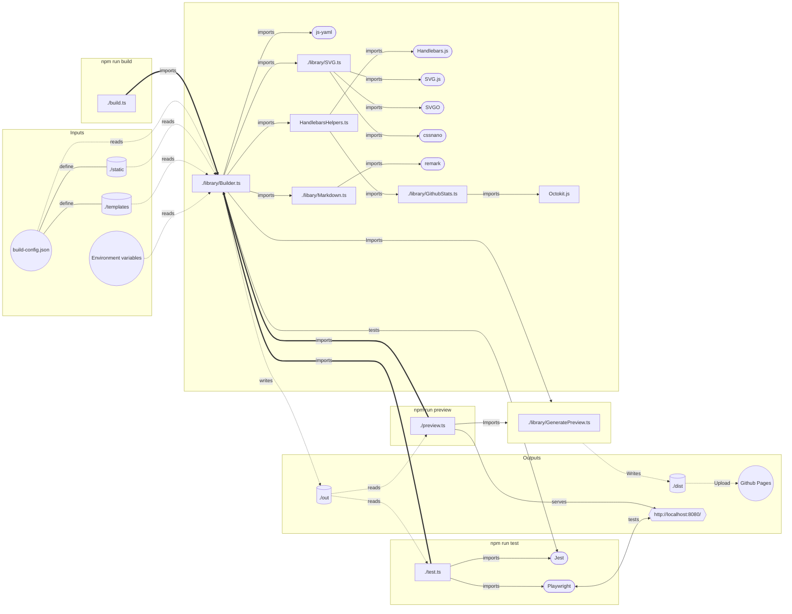

<h1 align="center"><strong><em>Jimbo The Frog's Github profile</em> 🐸</strong></h1>
<p align="center">
    <picture width="100%" align="center">
      <source media="(prefers-color-scheme: dark)" srcset="../jimbo-dark.svg">
      
    </picture>
</p>

<p align="center">
  <a href="https://www.typescriptlang.org/"></a>
  <a href="https://github.com/JimboTheFrog/JimboTheFrog/actions/workflows/build.yml"></a>
  <a href="https://github.com/JimboTheFrog/JimboTheFrog/blob/master/LICENSE"></a>
  <a href="https://api.github.com/repos/JimboTheFrog/JimboTheFrog"></a>
</p>

> 🐸 Forked from [dylanlangston/dylanlangston](https://github.com/dylanlangston/dylanlangston) — the original build system, lovingly repurposed for a frog.

### A brief introduction 🎤
Hello and welcome! This repository contains the source code used to generate my Github profile readme. The core of this solution lies in using the combination of YAML and Handlebars as templates. The [`./build.ts`](./build.ts) file orchestrates the build process, utilizing [`./library/Builder.ts`](./library/Builder.ts) to generate assets based on templates like [`./templates/dylan.svg.hbs.yaml`](./templates/dylan.svg.hbs.yaml) and [`./templates/readme.md.hbs`](./templates/readme.md.hbs) defined in [`./build-config.json`](./build-config.json). These templates are processed using Handlebars, allowing for population of variables also defined in `./build-config.json`. The novel approach of SVG with YAML markup enhances readability and enables post-processing techniques to optimize the final SVG output.

### Building 🏗️

<table>
  <tr>
    <td>

__Getting the Source Code__
1. Clone the repository: 
    ```
    git clone https://github.com/JimboTheFrog/JimboTheFrog.git
    ```
2. Navigate to the project's source directory:
    ```
    cd JimboTheFrog/src
    ```

    </td>
  </tr>
  <tr></tr>
  <tr>
    <td>

__Installing Dependencies__
* Install npm packages:
   ```
   npm install
   ```

    </td>
  </tr>
  <tr></tr>
  <tr>
    <td>

__Building__

* To build, run the following command:
    ```
    npm run build
    ```

    </td>
  </tr>
  <tr></tr>
  <tr>
    <td>

__Test__
* To test, run the following command:
    ```
    npm run test
    ```

    </td>
  </tr>
  <tr></tr>
  <tr>
    <td>

__Preview__
1. To preview, run the following command:
    ```
    npm run preview
    ```
2. Open [http://localhost:8080/](http://localhost:8080/)

    </td>
  </tr>
</table>

### Dev Environment 💻
<table>
  <tr>
    <td colspan="6">
      This repository offers a streamlined development environment setup using a <a href="../.devcontainer/devcontainer.json"><code>devcontainer.json</code></a> file, allowing you to get up and running quickly with a fully-featured environment in the cloud.<sup><a href="#local-development" id="fnref-local-development">[1]</a></sup> Use one of the following links to get started:
    </td>
  </tr>
  <tr>
    <td colspan="2">
      <p align="center">
        <a href="https://codespaces.new/JimboTheFrog/JimboTheFrog"></a>
      </p>
    </td>
    <td colspan="2">
      <p align="center">
        <a href="https://vscode.dev/redirect?url=vscode://ms-vscode-remote.remote-containers/cloneInVolume?url=https://github.com/JimboTheFrog/JimboTheFrog"></a>
      </p>
    </td>
    <td colspan="2">
      <p align="center">
        <a href="https://devpod.sh/open#https://github.com/JimboTheFrog/JimboTheFrog"></a>
      </p>
    </td>
  </tr>
  <tr>
    <td colspan="6">
      If you want to browse the source code without the need to build, you can do so conveniently on GitHub.dev or VSCode.dev:
    </td>
  </tr>
  <tr>
    <td colspan="3">
      <p align="center">
        <a href="https://github.dev/JimboTheFrog/JimboTheFrog"></a>
      </p>
    </td>
    <td colspan="3">
      <p align="center">
        <a href="https://vscode.dev/github/JimboTheFrog/JimboTheFrog"></a>
      </p>
    </td>
  </tr>
</table>
</p>

### Solution Architecture 🏰


### Citations 📓
In this project, we utilize images sourced from publicly available resources.
<table>
  <tr>
    <td></td>
    <td>
      <p><em>Swamp / Bayou, Louisiana</em></p>
      <p>Photo by skeeze</p>
      <p>Source: <a href="https://pixabay.com/photos/swamp-bayou-louisiana-moss-cypress-169168/">Pixabay</a></p>
      <p>License: Pixabay Content License (free for commercial use, no attribution required — but credit given anyway because I'm a frog with integrity)</p>
    </td>
  </tr>
  <tr>
    <td>
      <p>Hello World Font: <em>Rock Salt</em></p>
    </td>
    <td>
      <p>Source: <a href="https://www.fontsquirrel.com/fonts/rock-salt">Fontsquirrel</a></p>
      <p>License: Apache License v2.00</p>
    </td>
  </tr>
  <tr>
    <td>
      <p>Git Statistics Font: <em>Jetbrains Mono</em></p>
    </td>
    <td>
      <p>Source: <a href="https://www.jetbrains.com/lp/mono/">Jetbrains</a></p>
      <p>License: SIL OPEN FONT LICENSE Version 1.1</p>
    </td>
  </tr>
  <tr>
    <td>
      <p>April Fools Font: <em>Lobster</em></p>
    </td>
    <td>
      <p>Source: <a href="https://www.dafont.com/lobster.font">dafont</a></p>
      <p>License: Public domain / GPL / OFL</p>
    </td>
  </tr>
  <tr>
    <td>
      <p>Cinco De Mayo Font: <em>SD Festival</em></p>
    </td>
    <td>
      <p>Source: <a href="https://www.fontspace.com/sd-festival-font-f96437">Fontspace</a></p>
      <p>License: Demo</p>
    </td>
  </tr>
  <tr>
    <td>
      <p>Earth Day Font: <em>Cabin Sketch</em></p>
    </td>
    <td>
      <p>Source: <a href="https://fonts.google.com/specimen/Cabin+Sketch">Google Fonts</a></p>
      <p>License: SIL OPEN FONT LICENSE Version 1.1</p>
    </td>
  </tr>
  <tr>
    <td>
      <p>Happy Halloween Font: <em>PW HALLOWEEN</em></p>
    </td>
    <td>
      <p>Source: <a href="https://www.fontspace.com/pw-halloween-font-f41064">Fontspace</a></p>
      <p>License: Freeware, commercial use requires donation</p>
    </td>
  </tr>
  <tr>
    <td>
      <p>Happy New Year Font: <em>Summers Firecrackers</em></p>
    </td>
    <td>
      <p>Source: <a href="https://www.fontspace.com/summers-firecrackers-font-f5415">Fontspace</a></p>
      <p>License: Freeware</p>
    </td>
  </tr>
  <tr>
    <td>
      <p>Happy Valentines Font: <em>Hearts With Everything</em></p>
    </td>
    <td>
      <p>Source: <a href="https://www.fontspace.com/hearts-with-everything-font-f10517">Fontspace</a></p>
      <p>License: Freeware, Non-Commercial</p>
    </td>
  </tr>
  <tr>
    <td>
      <p>Christmas Font: <em>Christmas Snow</em></p>
    </td>
    <td>
      <p>Source: <a href="https://www.fontspace.com/christmas-snow-font-f103296">Fontspace</a></p>
      <p>License: Freeware, Non-Commercial</p>
    </td>
  </tr>
  <tr>
    <td>
      <p>Saint Patricks Font: <em>Irish Clovers</em></p>
    </td>
    <td>
      <p>Source: <a href="https://www.fontspace.com/irish-clovers-font-f76037">Fontspae</a></p>
      <p>License: Demo</p>
    </td>
  </tr>
  <tr>
    <td>
      <p>Star Wars Font: <em>Death Star</em></p>
    </td>
    <td>
      <p>Source: <a href="https://www.dafont.com/death-star.font">dafont</a></p>
      <p>License: Free for personal use</p>
    </td>
  </tr>
</table>

### Special Thanks 🙏
Shout out to [Andrew6rant](https://github.com/Andrew6rant/Andrew6rant)'s fantastic github profile for inspiration and the css used for the [`templates/stats.svg.hbs.yaml`](templates/stats.svg.hbs.yaml).

### External Resources ℹ️
Here are some additional resources which are used:
<table>
  <tr>
    <td><a href="https://github.com/cssnano/cssnano">cssnano</a> - Used to optimize CSS</td>
  </tr>
  <tr>
    <td><a href="https://github.com/handlebars-lang/handlebars.js">Handlebars.js</a> - Used to Populate Templates</td>
  </tr>
  <tr>
    <td><a href="https://github.com/nodeca/js-yaml">js-yaml</a> - Used to read YAML templates</td>
  </tr>
  <tr>
    <td><a href="https://github.com/jestjs/jest">Jest</a> - Unit testing</td>
  </tr>
  <tr>
    <td><a href="https://github.com/octokit/octokit.js">Octokit.js</a> - Used to retrieve Github Stats</td>
  </tr>
  <tr>
    <td><a href="https://github.com/opentypejs/opentype.js">opentype.js</a> - Used to generate SVG paths from fonts</td>
  </tr>
  <tr>
    <td><a href="https://github.com/microsoft/playwright">Playwright</a> - Integration testing</td>
  </tr>
  <tr>
    <td><a href="https://github.com/remarkjs/remark">remark</a> - Used to generate and optmize Markdown</td>
  </tr>
  <tr>
    <td><a href="https://github.com/svgdotjs/svg.js">SVG.js</a> - Used to generate SVGs</td>
  </tr>
  <tr>
    <td><a href="https://github.com/svg/svgo">SVGO</a> - Used to optimize SVGs</td>
  </tr>
</table>

### License 📜
This repository is licensed under the [MIT License](https://opensource.org/licenses/MIT). See the [`LICENSE`](https://github.com/JimboTheFrog/JimboTheFrog/blob/main/LICENSE) file for details.

<h2 id="footer"></h2>
<sub>
<section>
  <ol dir="auto">
    <li id="local-development">
    <p>For local development check out <a href="https://marketplace.visualstudio.com/items?itemName=ms-vscode-remote.remote-containers">Dev Containers</a> and <a href="https://devpod.sh/">DevPod</a>. <a href="#fnref-local-development" aria-label="Back to reference 1">↩</a></p>
    </li>
  </ol>
</section>
</sub>
